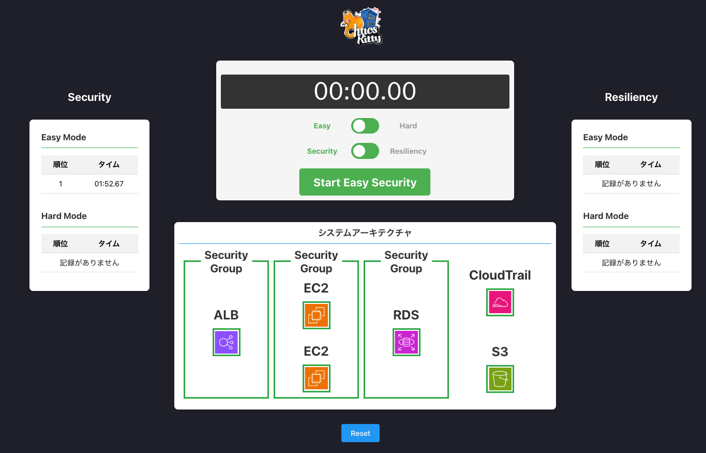
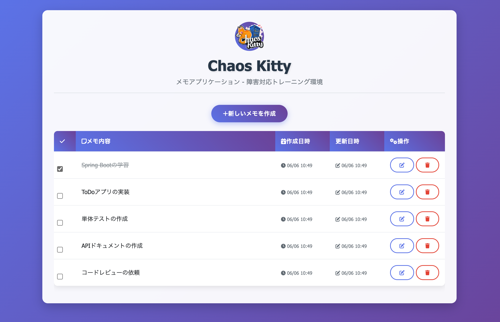
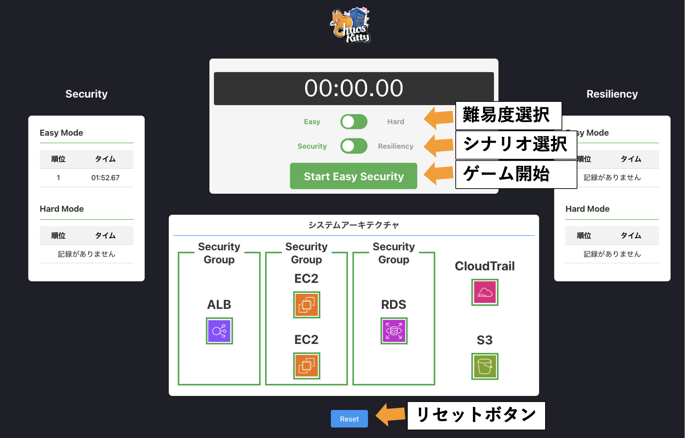

# プレイ方法
## 各種URLを開く
以下の二つのURLにアプリケーションがデプロイされているので開いてください。
### ゲーム画面Webアプリケーション


デプロイ完了後に表示されるCloudFront Distribution URLを使用して、Webアプリケーションにアクセスできます：

```
https://<cloudfront-distribution-domain-name>
```
この画面からゲームのシナリオおよび難易度の選択をおこない、ゲームを開始します。
### デモアプリケーション（Todoアプリ）

デプロイ完了後に表示されるALB DNS名を使用して、デモアプリケーションにアクセスできます：

```
http://<alb-dns-name>
```
障害を注入する対象のwebアプリケーションです。

## ゲームプレイ手順
### 1. ゲームシナリオの選択
二つのゲームシナリオがあるので、プレイするシナリオをトグルスイッチで選択してください。
セキュリティシナリオはセキュリティ的な脆弱性が注入され、レジリエンスシナリオはデモアプリケーションがアクセスできなくなる障害が発生します。
### 2. ゲーム難易度選択
各シナリオに対して、EasyとHardの難易度があるので、トグルスイッチで選択してください。
### 3. ゲームの開始
Startボタンを押すことでゲームが開始し、タイマーが計測を開始します。開始と同時にシナリオと難易度に応じた様々な障害が発生します。障害が発生した箇所はゲームページのアイコンが点滅を始めるので、これを参考にAWSマネジメントコンソールから適切な修正を行います。修正が完了した場所から点滅が止まるので、ゲーム画面を見て現状を確認しながら進めましょう(反映に多少時間がかかることがあります)。
### 4. ゲーム結果
すべての修正が完了した場合、タイマーが止まりゲーム結果画面が表示されます。
「キャンセル」を押した場合、タイムはランキングに登録されません。

### 5. リセットボタン
リセットボタンを押すことでゲームの進行中でもゲームを中断し、障害を自動で修正することができます。EC2の再起動などが行われるため、完了に時間がかかります。



## 各シナリオで発生する障害一覧
Easyモードでは対象の障害の中から一つだけランダムに発生します。Hardモードでは対象の障害がすべて同時に発生します。

### セキュリティシナリオ一覧

|No.|障害箇所|シナリオ内容|修正方法|Easy|Hard|
|:----|:----|:----|:----|:----|:----|
|1|ALB SG|ALBのセキュリティグループのインバウンドにソース0.0.0.0/0からsshポート通信許可が設定される|設定の削除|◯|◯|
|2|EC2 SG|EC2のセキュリティグループのインバウンドにソース0.0.0.0/0からsshポート通信許可が設定される|設定の削除|◯|◯|
|3|EC2 Role|EC2に設定されているIAMロールがUnsafeRoleという誤りのあるロールが設定される。|IAMロールをSafeRoleに設定し直す|◯|◯|
|4|S3|S3のバケットがパブリックアクセスブロックOFFの設定がされる|パブリックアクセスブロックONの設定に変更する|◯|◯|
|5|RDS SG|RDSのセキュリティグループのインバウンドにソース0.0.0.0/0からポート3306通信許可が設定される|設定の削除|◯|◯|
|6|CloudTrail|CloudTrailの設定が無効になる|CloudTrailの設定の有効化|◯|◯|

### レジリエンスシナリオ一覧

|No.|障害箇所|シナリオ内容|修正方法|Easy|Hard|
|:----|:----|:----|:----|:----|:----|
|1|EC2|EC2がシャットダウンされる|EC2の起動|◯|◯|
|2|ALB|ALBのセキュリティグループのインバウンドにソース0.0.0.0/0からhttp通信許可の設定が削除される|ALBのセキュリティグループのインバウンドにソース0.0.0.0/0からhttp(port80)通信許可の設定をする|◯|◯|
|3|EC2|EC2のセキュリティグループのインバウンドにソースALBからポート8080通信許可の設定が削除される|EC2のセキュリティグループのインバウンドにソースALBからポート8080通信許可の設定をする。|◯|◯|
|4|EC2|EC2上のアプリケーションプロセスがKillされる|EC2の再起動|◯| |