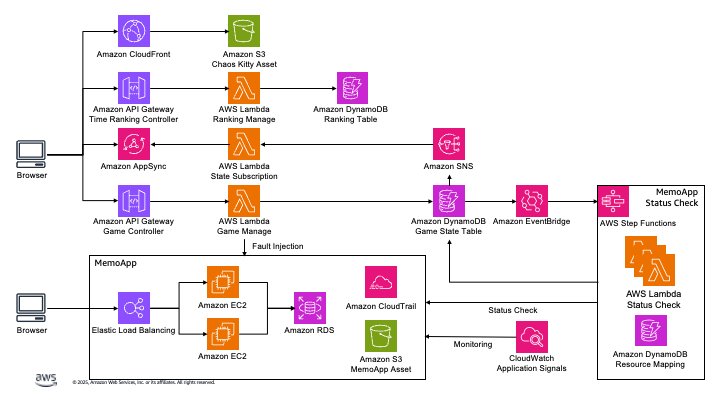

# メモアプリケーションシステム設計書

## 概要

本システムは以下の4つの主要コンポーネントで構成されています：

1. メモアプリケーション - トレーニング対象となる実際のアプリケーション
2. 障害発生機能 - 設定されたシナリオに基づき障害を発生させる機能
3. 状態監視機能 - 障害状態と修復状態を監視する機能
4. 修復機能 - 障害状態をリセットして初期状態に戻す機能

---

## 1. メモアプリケーションの構成

### アーキテクチャ

シンプルな3層構造で構成されています：

- **プレゼンテーション層**: Elastic Load Balancer (ALB)
- **アプリケーション層**: EC2インスタンス (2台の冗長構成)
- **データ層**: Amazon RDS

### 実行環境

- EC2インスタンス上でPythonアプリケーションが稼働
- 関連リソース
  - セキュリティグループ (ALB, EC2, RDS)
  - IAMロール (EC2)
  - S3バケット
  - CloudTrail

---

## 2. 障害発生機能

### ゲームフロー

1. **開始条件**

   - DynamoDBの`GameState`テーブルを確認
   - `State`が`Ready`の場合のみゲームを開始可能
   - ゲーム開始時に`State`は`Ongoing`に変更される

2. **障害発生と修復**

   - 選択したシナリオに応じて障害が発生
   - システムコンポーネントの状態がDynamoDBで`Green`から`Red`に変化
   - 参加者が適切な修正を行うと、監視Lambdaが状態変化を検知
   - 状態が`Red`から`Green`に復帰

3. **クリア条件**
   - 全てのコンポーネントが`Green`状態に戻るとゲームクリア
   - IoT Coreを通じて対応する物理ランプが赤から緑に変化

### シナリオタイプ

#### 難易度設定

- **Easy モード**: 1つの障害がランダムに発生
- **Hard モード**:
  - セキュリティ: 4つの障害がランダムに発生
  - レジリエンス: 全ての障害（1-3）が発生

#### セキュリティシナリオ一覧

| No. | 障害箇所   | シナリオ内容                                                                               | 修正方法                                     | Easy | Hard |
| :-- | :--------- | :----------------------------------------------------------------------------------------- | :------------------------------------------- | :--- | :--- |
| 1   | ALB SG     | ALBのセキュリティグループのインバウンドにソース0.0.0.0/0からsshポート通信許可が設定される  | 設定の削除                                   | ◯    | ◯    |
| 2   | EC2 SG     | EC2のセキュリティグループのインバウンドにソース0.0.0.0/0からsshポート通信許可が設定される  | 設定の削除                                   | ◯    | ◯    |
| 3   | EC2 Role   | EC2に設定されているIAMロールがUnsafeRoleという誤りのあるロールが設定される。               | IAMロールをSafeRoleに設定し直す              | ◯    | ◯    |
| 4   | S3         | S3のバケットがパブリックアクセスブロックOFFの設定がされる                                  | パブリックアクセスブロックONの設定に変更する | ◯    | ◯    |
| 5   | RDS SG     | RDSのセキュリティグループのインバウンドにソース0.0.0.0/0からポート3306通信許可が設定される | 設定の削除                                   | ◯    | ◯    |
| 6   | CloudTrail | CloudTrailの設定が無効になる                                                               | CloudTrailの設定の有効化                     | ◯    | ◯    |

#### レジリエンスシナリオ一覧

| No. | 障害箇所 | シナリオ内容                                                                               | 修正方法                                                                                     | Easy | Hard |
| :-- | :------- | :----------------------------------------------------------------------------------------- | :------------------------------------------------------------------------------------------- | :--- | :--- |
| 1   | EC2      | EC2がシャットダウンされる                                                                  | EC2の起動                                                                                    | ◯    | ◯    |
| 2   | ALB      | ALBのセキュリティグループのインバウンドにソース0.0.0.0/0からhttp通信許可の設定が削除される | ALBのセキュリティグループのインバウンドにソース0.0.0.0/0からhttp(port80)通信許可の設定をする | ◯    | ◯    |
| 3   | EC2      | EC2のセキュリティグループのインバウンドにソースALBからポート8080通信許可の設定が削除される | EC2のセキュリティグループのインバウンドにソースALBからポート8080通信許可の設定をする。       | ◯    | ◯    |
| 4   | EC2      | EC2上のアプリケーションプロセスがKillされる                                                | EC2の再起動                                                                                  | ◯    |      |

---

## 3. データモデル（DynamoDB）

### テーブル構造

#### GameStateテーブル

| 属性名 | 型          | 説明               | 値の例                          |
| :----- | :---------- | :----------------- | :------------------------------ |
| GameId | String (PK) | ゲームの識別子     | "default"                       |
| State  | String      | ゲームの現在の状態 | "Ready", "Ongoing", "Resetting" |

#### SecurityScenarioテーブル

| 属性名        | 型          | 説明                   | 値の例                                                        |
| :------------ | :---------- | :--------------------- | :------------------------------------------------------------ |
| ComponentName | String (PK) | コンポーネント名       | "ALB SG", "EC2 SG", "EC2 Role", "S3", "RDS SG", "CloudTrail"  |
| InitialValue  | String      | コンポーネントの初期値 | "secure-config", "SafeRole", "block-public-access", "enabled" |
| CurrentState  | String      | 現在の状態             | "Green", "Red"                                                |
| Description   | String      | コンポーネントの説明   | "ALBのセキュリティグループ設定"                               |

#### ResilienceScenarioテーブル

| 属性名        | 型          | 説明                   | 値の例                                          |
| :------------ | :---------- | :--------------------- | :---------------------------------------------- |
| ComponentName | String (PK) | コンポーネント名       | "EC2", "ALB SG", "EC2 SG", "EC2 Process"        |
| InitialValue  | String      | コンポーネントの初期値 | "running", "http-allowed", "alb-to-ec2-allowed" |
| CurrentState  | String      | 現在の状態             | "Green", "Red"                                  |
| Description   | String      | コンポーネントの説明   | "EC2インスタンスの状態"                         |

#### ResourceMappingテーブル

| 属性名         | 型          | 説明                 | 値の例                                                    |
| :------------- | :---------- | :------------------- | :-------------------------------------------------------- |
| ResourceType   | String (PK) | リソースタイプ       | "EC2_INSTANCE_1", "ALB_SG", "EC2_SAFE_ROLE", "S3_BUCKET"  |
| ResourceId     | String      | リソースID           | "i-1234567890abcdef0", "sg-1234567890abcdef0"             |
| ResourceName   | String      | リソース名           | "MemoAppInstance1", "MemoAppALBSecurityGroup"             |
| ResourceArn    | String      | リソースARN          | "arn:aws:ec2:region:account:instance/i-1234567890abcdef0" |
| AdditionalInfo | String      | 追加情報（JSON形式） | {"state": "running", "privateIp": "10.0.0.1"}             |

---

## 4. 状態監視の仕組み

1. **アプリ状態監視Lambda(StepFunctions)**

   - メモアプリの各種設定値とDynamoDBの初期値を常に比較
   - 一致したタイミングで状態を`Red`から`Green`に変更
   - 各コンポーネント（ALB SG, EC2 SG, EC2 Role, S3, RDS SG, CloudTrail, EC2 OS, EC2 Process）ごとに専用の監視Lambdaが実装されている

2. **DynamoDBストリーム**

   - 状態が`Green`に変更されると、DynamoDBストリームがトリガー
   - EventBridge Pipesを通じてSNSトピックに通知を送信

3. **SNSトピック**
   - セキュリティシナリオとレジリエンスシナリオ用の個別のトピックが用意されている
   - 物理的なインジケータ（ランプ）を赤から緑に変更するための通知を送信

## 5. 修復機能

### 目的と機能

- ゲーム進行中でも初期状態にリセット可能
- CDKデプロイ直後の状態に設定を戻す
- すべてのコンポーネント状態をGreenに変更

### 実装

- Lambda関数として実装（AWS SDK v3を使用）
- 手動または自動トリガーで実行可能
- APIゲートウェイを通じて呼び出し可能
